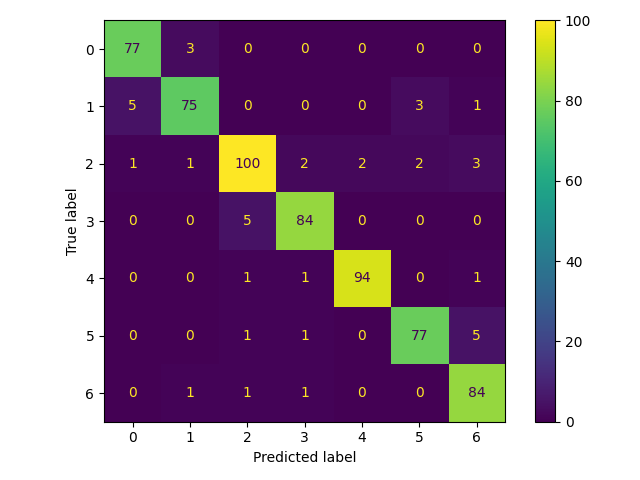

# Obesity Estimation Pipeline

Este proyecto implementa un flujo automatizado para el **análisis, procesamiento, modelado y evaluación de datos relacionados con la estimación de obesidad**, utilizando **Python** y **DVC (Data Version Control)**.  
El pipeline facilita la reproducibilidad completa del experimento, desde los datos crudos hasta los resultados de modelos y métricas comparativas.

---

## Estructura del proyecto

```
.
├── data/
│   ├── raw/                         # Datos originales con modificaciones del equipo docente.
│   ├── target/                      # Datos originales de la fuente. NO utilizados.
│   ├── processed/                   # Datos limpios y transformados.
│   ├── prepared/                    # Conjuntos de entrenamiento y prueba
│   │   └── class_distribution.csv   # Estadísticas de distribución de clases (no versionado en DVC)
├── src/
│   └── scripts/                     # Scripts Python del pipeline
│       ├── 01_cleaning.py
│       ├── 02_eda.py                # Autogenerado a partir de Notebook - NO SE USA EN PIPELINE DVC.
│       ├── 02_eda_manual.py
│       ├── 03_preprocessing.py
│       └── 04_training.py
├── reports/
│   └── figures/                     # Gráficos y resultados del EDA
│   ├── model_comparison.csv         # Resultados de la primera ejecución del modelo 
│   ├── final_model_comparison.csv   # Resultados con las ejecuciones con hiperparámetros variables
│   ├── confusion_matrix.csv         # Matriz de confusión en formato texto
│   └── confusion_matrix.png         # Matriz de confusión en formato gráfico
├── dvc.yaml                         # Definición de las etapas del pipeline
├── dvc.lock                         # Registro automático de hashes y dependencias
├── .dvc/                            # Metadatos internos de DVC
└── .gitignore
```

---

## Requisitos

- **Python 3.13.7**
- **DVC >= 3.0**
- Git instalado y configurado

---

## Instalación

1. Clona el repositorio:

   ```bash
   git clone https://github.com/TecMNA2025MLOpsEq25/mna-mlops-sep2025-eq25.git
   cd mna-mlops-sep2025-eq25
   ```

2. Crea y activa un entorno virtual:

   ```bash
   python3 -m venv .venv
   source .venv/bin/activate   # En Linux/macOS
   .venv\Scripts\activate      # En Windows
   ```

3. Instala las dependencias:

   ```bash
   pip install -r requirements.txt
   ```

4. Asegúrate de tener configurado **DVC**:

   ```bash
   dvc --version
   ```

---

## Datos y control de versiones con DVC

El proyecto usa **DVC** para versionar datos y modelos de manera reproducible.  
El flujo de trabajo básico es:

```bash
# Descargar los datos y artefactos versionados (si hay remoto configurado)
dvc pull

# Ejecutar todo el pipeline (limpieza → preprocesamiento → entrenamiento → evaluación)
dvc repro

# Ver el estado de los datos/etapas
dvc status

# (Opcional) Subir los artefactos generados al remoto de DVC
dvc push
```

Los archivos versionados incluyen:
- Datos procesados (`data/processed/...`)
- Datos preparados (`data/prepared/...`)
- Modelo entrenado (`models/...`)
- Métricas y comparaciones finales (`reports/.../model_comparison.csv`, etc.)

---

## Configuración remota (ejemplo con Azure)

Cada usuario puede definir su propio almacenamiento remoto.  
Por ejemplo, para usar un **Azure Blob Storage** llamado `storage`:

```bash
dvc remote add -d azure_remote azure://storage/container/path
dvc remote modify azure_remote connection_string "DefaultEndpointsProtocol=https;AccountName=...;AccountKey=...;EndpointSuffix=core.windows.net"
```

Luego, para subir tus datos versionados:

```bash
dvc push
```

---

## Ejecución del pipeline

Para ejecutar todas las etapas (limpieza → preprocesamiento → entrenamiento → evaluación → reportes):

```bash
dvc repro
```

DVC ejecutará en orden los scripts definidos en `dvc.yaml`, generando los archivos y métricas correspondientes.

### Seguimiento de experimentos (MLflow)

Este proyecto integra **MLflow autolog** para registrar parámetros, métricas y artefactos durante el entrenamiento.

```bash
mlflow ui --port 8080
```

Abre http://127.0.0.1:8080 y revisa los *runs* (comparación de métricas, parámetros y artefactos).

---

## Resultados

Los resultados principales del pipeline se encuentran en:

- `reports/model_comparison.csv`  
- `reports/final_model_comparison.csv`  
- `reports/confusion_matrix.csv`  
- `reports/confusion_matrix.png`  
- `reports/figures/` (EDA y análisis exploratorio)
- `models/best_model.pkl`  *(modelo final entrenado de la Fase 2)*
- `reports/metrics.json`   *(métricas agregadas de evaluación de la Fase 2)*
- `docs/img/confusion_matrix_eval.png` *(matriz de confusión de evaluación integrada a documentación)*

---

## 🧩 Fase 2 — Tracking, Evaluación y CI

**Novedades principales:**
- **Stage `evaluate` en `dvc.yaml`**: genera `reports/metrics.json` (accuracy, precision/recall/f1 macro, roc_auc_ovr) y `reports/confusion_matrix_eval.png`.
- **MLflow autolog** durante el entrenamiento: registro automático de parámetros, métricas y artefactos; ejecución local con `mlflow ui`.
- **CI en GitHub Actions**: flujo que intenta `dvc pull` (si hay secretos), ejecuta `dvc repro` cuando es posible o `dvc status` como verificación y publica `reports/` como artifacts del job.

**Evidencias:**

| accuracy | precision_macro | recall_macro | f1_macro | roc_auc_ovr |
|---------:|----------------:|-------------:|---------:|------------:|
| (ver `reports/metrics.json`) | | | | |

**Matriz de confusión (evaluación):**



---

## Notas sobre control de versiones

- Los archivos grandes y datasets intermedios están controlados por **DVC**, no por Git.  
- Los archivos auxiliares (EDA, gráficas, resúmenes) pueden mantenerse **solo en local**.  
- Los `.dvc` antiguos deben eliminarse si su contenido ahora está definido en el `dvc.yaml`.

---


---

## 👥 Créditos

Proyecto desarrollado por:
| Nombre | Matrícula |
|--------|-----------|
| Rafael Becerra García | A01796211 |
| Andrea Xcaret Gómez Alfaro | A01796384 |
| David Hernández Castellanos | A01795964 |
| Juan Pablo López Sánchez | A01313663 |
| Osiris Xcaret Saavedra Solís | A01795992 |

Como parte del flujo de práctica de versionamiento reproducible con DVC y Git.
