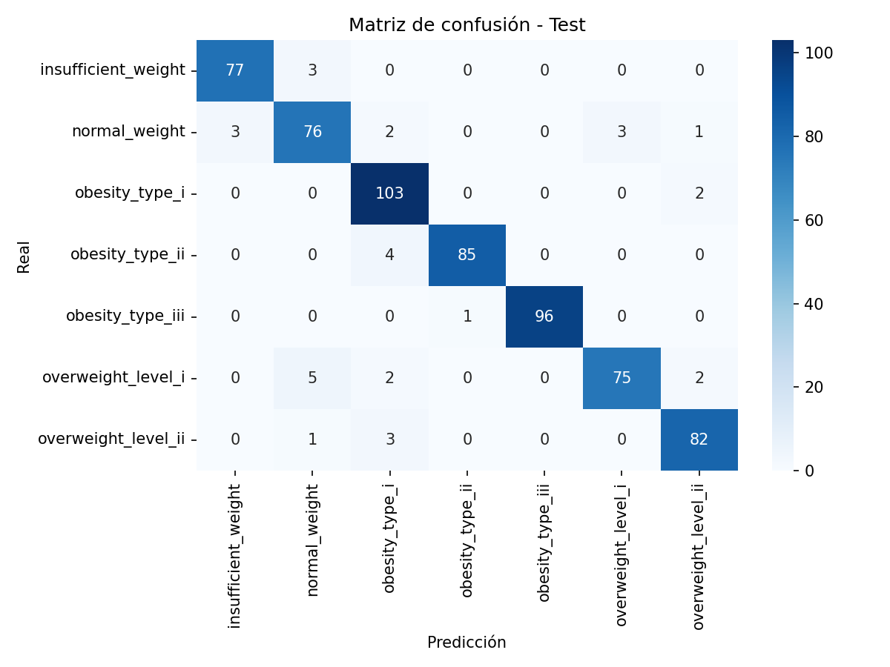

# Proyecto MLOps — Clasificación del Nivel de Obesidad

Repositorio oficial del proyecto de clasificación del nivel de obesidad utilizando técnicas de Machine Learning y principios de MLOps.  
Desarrollado por **Equipo 25 — Maestría en Inteligencia Artificial Aplicada (MNA 2025), Tecnológico de Monterrey**.

Repositorio: [TecMNA2025MLOpsEq25/mna-mlops-sep2025-eq25](https://github.com/TecMNA2025MLOpsEq25/mna-mlops-sep2025-eq25)

---

## 1. Propósito y contexto

El objetivo del proyecto es construir un pipeline reproducible de aprendizaje automático para clasificar el nivel de obesidad de una persona a partir de sus hábitos alimenticios, actividad física y características antropométricas.

El proyecto se diseñó bajo un enfoque de MLOps, integrando DVC (Data Version Control) para gestionar datos, dependencias, métricas y versiones de modelos, asegurando trazabilidad y reproducibilidad.

**Principios aplicados:**
- Separación modular por etapas y responsabilidades.
- Versionado de datos y modelos con DVC.
- Refactorización y buenas prácticas de código.
- Registro automático de métricas y visualizaciones.
- Reproducibilidad total mediante `dvc repro`.


---

## 2. Estructura del proyecto (tipo Cookiecutter)

Aunque se partió del template académico, la estructura se adaptó al estándar **Cookiecutter Data Science**, asegurando claridad y escalabilidad.

```
mna-mlops-sep2025-eq25/
│
├── data/
│   ├── raw/                  # Datos originales
│   ├── processed/            # Datos limpios
│   └── interim/              # Datos intermedios
│
├── obesity_estimator/        # Código fuente (equivalente a 'src/')
│   ├── dataset.py            # Limpieza de datos
│   ├── features.py           # Transformaciones y encoding
│   ├── plots.py              # EDA y visualizaciones
│   └── modeling/
│       ├── train.py          # Entrenamiento y búsqueda de hiperparámetros
│       ├── predict.py        # Evaluación
│       └── plot_curves.py    # Curvas ROC y PR
│
├── reports/
│   ├── figures/              # Imágenes generadas
│   ├── evaluation_results.csv
│   └── confusion_matrix.png
│
├── models/                   # Modelos entrenados (.joblib)
│
├── dvc.yaml                  # Pipeline DVC (definición de stages)
├── params.yaml               # Parámetros centralizados
├── requirements.txt
└── README.md
```

**Mapeo con Cookiecutter:**

| Cookiecutter estándar | Proyecto actual       |
|-----------------------|-----------------------|
| `src/`                | `obesity_estimator/`  |
| `data/raw`            | `data/raw/`           |
| `data/processed`      | `data/processed/`     |
| `notebooks/`          | `notebooks/`          |
| `reports/`            | `reports/`            |
| `models/`             | `models/`             |

---

## 3. Pipeline y etapas principales (DVC)

El pipeline está definido en [`dvc.yaml`](https://github.com/TecMNA2025MLOpsEq25/mna-mlops-sep2025-eq25/blob/master/dvc.yaml).  
Cada stage incluye dependencias, outputs y métricas versionadas.

| Etapa | Script | Descripción | Entradas | Salidas |
|-------|---------|-------------|-----------|----------|
| **prepare** | `obesity_estimator/dataset.py` | Limpieza de duplicados, outliers y validación de tipos. | `data/raw/obesity_estimation_modified.csv` | `data/processed/obesity_estimation_clean.csv` |
| **eda** | `obesity_estimator/plots.py` | Análisis exploratorio y generación de gráficos. | Datos procesados | `reports/figures/eda/*` |
| **preprocessing** | `obesity_estimator/features.py` | Codificación y escalado. Serializa el preprocesador. | Datos procesados | `data/interim/*`, `preprocessor.pkl` |
| **training** | `obesity_estimator/modeling/train.py` | Entrenamiento y ajuste de hiperparámetros. | Datos preprocesados | `models/*.joblib`, `reports/metrics.json` |
| **evaluation** | `obesity_estimator/modeling/predict.py` | Evaluación y métricas finales. | Modelos entrenados | `reports/evaluation_results.csv`, `reports/confusion_matrix.png` |
| **model_plots** | `obesity_estimator/modeling/plot_curves.py` | Curvas ROC y PR comparativas. | Modelos + test | `reports/figures/models/*`, `reports/roc_auc_by_model.csv`, `reports/pr_auc_by_model.csv` |

---

## 4. Descripción técnica de fases y resultados

### Fase 1 — prepare: Limpieza y validación
- 2,111 → 2,087 filas tras eliminar duplicados.
- Conservación de proporciones de clase.
- Dataset validado sin sesgo ni pérdida de información.

### Fase 2 — eda: Exploratory Data Analysis
- Distribuciones, correlaciones y variables influyentes.
- FAF (actividad física) y FAVC (comida calórica) fueron predictores relevantes.
- Diferencias significativas por género y transporte (MTRANS).

Ejemplo de salida:  


### Fase 3 — preprocessing: Transformación
- One-Hot Encoding de variables categóricas.
- Escalado de numéricas.
- División Train/Test (70/30) estratificada.
- 24 variables finales, sin fuga de información.

### Fase 4 — training: Modelado y ajuste

| Modelo                 | F1-macro | ROC-AUC | Comentario                       |
|------------------------|----------|---------|----------------------------------|
| HistGradientBoosting   | **0.9673** | **0.972** | Mejor rendimiento y generalización |
| Random Forest          | 0.952    | 0.962   | Estable y balanceado             |
| SVC (RBF)              | 0.935    | 0.941   | Precisión alta, menor recall     |
| Logistic Regression    | 0.918    | 0.924   | Baseline de referencia           |

El modelo final seleccionado fue **HistGradientBoosting**, por su equilibrio entre precisión y recall.

### Fase 5 — evaluation: Métricas finales
- F1-macro superior a 0.96 en todas las clases.
- Buen recall en clases minoritarias.
- Matriz de confusión sin evidencia de sobreajuste.



### Fase 6 — model_plots: Curvas comparativas
  


El modelo HistGradientBoosting domina tanto en AUC-ROC (0.972) como en AUC-PR (0.970).

---

## 5. Ejecución del pipeline completo

```bash
python -m venv .venv
source .venv/bin/activate      # En Linux/Mac
# .venv\Scripts\activate.bat   # En Windows
pip install -r requirements.txt
dvc repro
```

**Salida esperada:**
- Generación automática de archivos en `reports/` y `models/`.
- Métricas actualizadas en `reports/metrics.json`.
- Reproducibilidad completa a través de `params.yaml`.

---

## 6. Resultados comparativos globales

| Modelo               | F1-macro | Accuracy | ROC-AUC | PR-AUC | Observación    |
|----------------------|----------|----------|---------|--------|----------------|
| **HistGradientBoosting** | **0.9673** | **0.969** | **0.972** | **0.970** | Modelo final     |
| Random Forest        | 0.952    | 0.958    | 0.962   | 0.957  | Buen recall     |
| SVC (RBF)            | 0.935    | 0.942    | 0.941   | 0.940  | Alta precisión  |
| Logistic Regression  | 0.918    | 0.921    | 0.924   | 0.926  | Baseline        |

---
## 7 Aplicación de Mejores Prácticas de Codificación en el Pipeline de Modelado

La etapa de modelado fue rediseñada para incorporar las mejores prácticas de ingeniería de ML:

Evitar Data Leakage:
Las transformaciones se aplican dentro del Pipeline() y solo sobre los datos de entrenamiento.

Codificación y escalado encapsulados:
Se usaron OneHotEncoder y StandardScaler dentro del pipeline, preservando la consistencia entre entrenamiento y predicción.

Selección automática de hiperparámetros:
El script detecta el tamaño del grid y selecciona entre GridSearchCV o RandomizedSearchCV según el número de combinaciones posibles, optimizando tiempo y precisión.

Cross-Validation Estratificada:
Implementación de StratifiedKFold para mantener la distribución de clases en todas las divisiones.

Métricas robustas:
Se evaluó con F1-macro, accuracy, precision y recall, priorizando la equidad entre clases desbalanceadas.

Reproducibilidad total:
Se usaron random_state=42 y versionamiento en DVC para garantizar que cada ejecución pueda replicarse.

Automatización de comparación de modelos:
Todos los modelos generan un archivo final_model_comparison.csv donde se documentan los resultados de cada configuración.

Interpretabilidad:
Se añadieron análisis automáticos de feature importance y confusion matrix, guardando las figuras para revisión.

---
## 8. Roles del equipo y responsabilidades

| Rol               | Nombre               | Responsabilidades principales                                                       |
|-------------------|----------------------|-------------------------------------------------------------------------------------|
| Data Engineer     | David Hernández C.   | Ingesta, pipelines DVC, versionado de datos, automatización y CI/CD.               |
| Data Scientist    | Rafael López         | Modelado, feature engineering, tuning y análisis de resultados.                     |
| Software Engineer | Juan Pablo L. S.     | Refactorización, estructura Cookiecutter, validaciones y documentación.            |
| ML Engineer       | Osiris X. Saavedra   | Integración de modelos, pipelines de entrenamiento, métricas y artefactos.         |
| SRE / DevOps      | Andrea X. Gómez      | Configuración de entorno, control de versiones, revisión y reproducibilidad.        |

**Interacciones:**  
Trabajo colaborativo vía GitHub PRs, issues y branches, con revisiones cruzadas entre roles.

---

## 9. Evidencias de colaboración (GitHub)

- Commits totales: +70  
- Pull Requests cerrados: 10  
- Contribuidores activos: 5  

Ejemplo de comando de auditoría:
```bash
git shortlog -sne --since="2025-10-01"
```

Capturas documentadas en el PDF:
- PRs revisados y aprobados.
- Pipeline DVC ejecutado (`dvc repro`).
- Resultados de pruebas unitarias (`pytest -q`).
- Workflow de CI/CD (en integración).

---

## 10. Métricas clave del proyecto

| Tipo              | Métrica     | Valor     | Descripción                                  |
|-------------------|-------------|-----------|----------------------------------------------|
| Modelo final      | F1-macro    | **0.9673**| Métrica principal de desempeño               |
| Reproducibilidad  | `dvc repro` | Exitosa   | Pipeline ejecutado sin errores               |
| Balance de clases | —           | 7 niveles | Sin sesgo dominante                          |
| Overfitting       | Δ F1 t–t    | < 0.01    | Sin sobreajuste                              |
| Rendimiento       | Tiempo total| 45 s      | Pipeline completo                             |
| Artefactos        | Generados   | 30+       | Datos, figuras, métricas y modelos           |

---

## 11. Conclusiones generales

1. Pipeline totalmente reproducible y versionado con DVC.  
2. HistGradientBoosting ofrece la mejor precisión y estabilidad.  
3. Estructura modular y escalable, alineada al estándar Cookiecutter.  
4. Equipo interdisciplinario con roles claramente definidos.  
5. Trazabilidad completa de datos, métricas y modelos.

---

## 12. Referencias

- Provost, F. & Fawcett, T. (2013). *Data Science for Business*.  
- Chapman et al. (2000). *CRISP-DM 1.0: Step-by-Step Data Mining Guide*.  
- Documentación de DVC: https://dvc.org/doc  
- Scikit-Learn API Reference: https://scikit-learn.org/stable/user_guide.html  
- MLflow Documentation: https://mlflow.org/docs/latest/index.html
